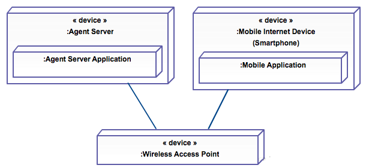
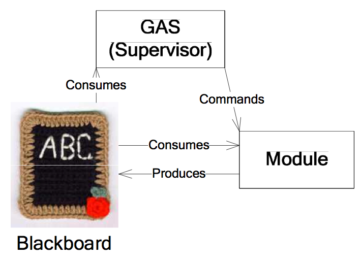

# Assignment 2

## Mobile Agents

**(a) In the SAD Mobile Agents, paragraph 4.3, the choice for the agent framework is an important design decision. Write it down using the design decision format presented at the lectures.**

__Option Description:__  
The Java Agent Development Framework (JADE) is a middleware developed by TILAB for developing distributed multi-agent applications.

__Pros:__

- Meets the FIPA standards;
- Writting in Java, which makes it platform and hardware independant;
- Open-source software (LGPL license);
- Large community, which is helpful for answering questions and solving problems;
- Allows for running all the required agent options.

__Cons:__  

The framework is written in Java, which could mean the software is slow.

__Risks and Issues:__  

The last release was on 2 july 2009, while the document is written in june 2010. This could indicate slow development cycles, but could also mean the product is well matured.

Also little attention is given to communication between agent systems.

__Assumptions and Constraints:__  

The framework is not developed as open-source, which might mean the development may stagnate.

__Points of Note:__  

The Java VM can become slow if the codebase is too large.

**(b) Which RUP view is missing in this document? Is this a problem?**

The _Process View_ is missing which is a big problem. Since the JADE framework is used to meet the FIPA standards, which allows for communication with other agent systems, it is essential that the way of communication is documented.

There is no information given on distribution, scalability, or performance. And no UML diagrams to represent process views, such as a Activity diagram to indicate the dependencies between agent systems.

**(c) Give an UML deployment diagram to add to chapter 5.**

## GAIUS

**(d) In GAIUS Architecture Description chapter 2 talks about "system roles". Are these comparable to stakeholders or to use case actors?**

These are comparable to Use Case Actors.

**(e) Explain the difference between stakeholders and use case actor. Give examples.**

Stakeholders are people who have an interest in the system. This group of people may include investors, higher management, users of the system, or partners from system dependencies. An example is a company officer who invests in a system to improve their business processes, but who will never use actual the system himself.

Actors interact with the system. Actors are tighly coupled to the UML Use Cases. They might be humans sitting at the computer or other systems calling APIs or being called via APIs.

**(f) To which RUP view does the information belong that is presented in 4.2.3?**

It clearly describes communication between components and therefore belongs to a logical view.

**(g) In 4.3.1 the Blackboard pattern is mentioned. This is an example of an architectural pattern. Explain in a few sentences what an architectural pattern is.**

Patterns are often defined as "strictly described and commonly available". A design pattern in general is a recognised and reused solution to a recurring problem in the field of software design. An architectural pattern is therefore a reusable solution to an architectural problem, which has a broader scope than the concept of a design pattern. These patterns are used in the field of software engineering and address issues such as (hardware) performance limitations, availability, and business risks.

Source: https://en.wikipedia.org/wiki/Architectural_pattern

**(h) Explain the Blackboard pattern.**

The Blackboard pattern is a behavorial design pattern. Which helps to reduce both complexity and duplication of code, as reduced coupling between sender and receiver - which improves the system's flexibility.

The Blackboard pattern in particular is used to coordinate separate systems that need to work together, or in sequence, continually prioritizing the actors. This is done through a shared storage, which acts as a messagebox that can be accessed by (physically) separate processes. A controller monitors the values in the messagebox (or the properties on "the blackboard") and makes decisions about priorization of the processes (actors).

Source: http://social.technet.microsoft.com/wiki/contents/articles/13215.blackboard-design-pattern.aspx
