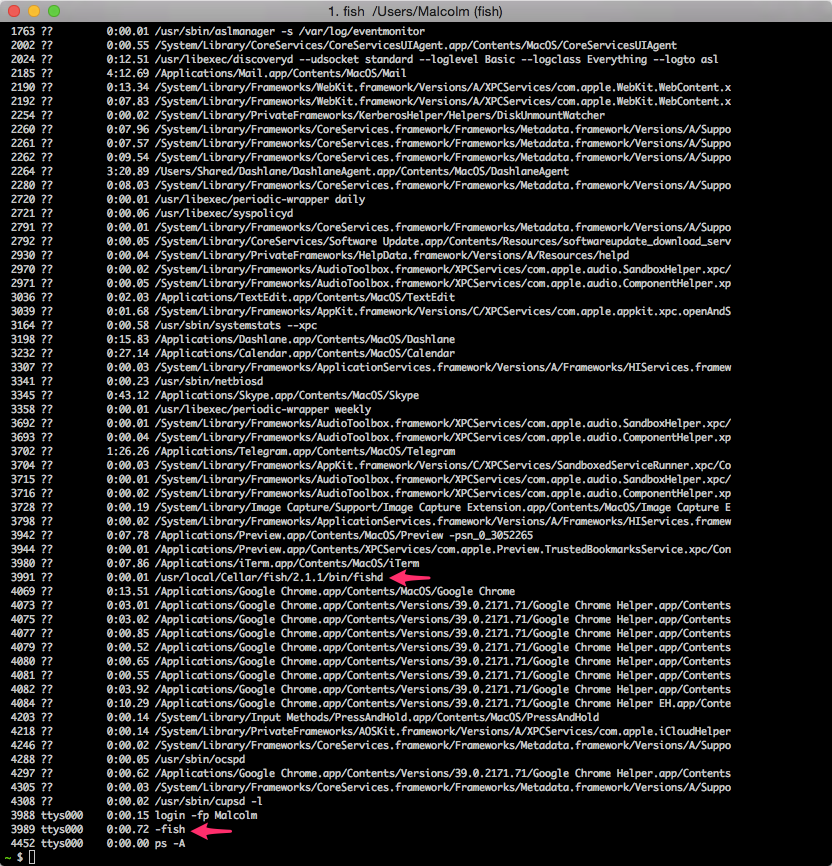
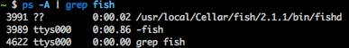

# Assesment 2 - Architectural Patterns

__(a). Describe in your own words what the difference is between design patterns as taught in the previous period (the Gang-of-Four patterns) and architectural patterns.__

By using architectural patterns a solution for achieving a quality property can be implemented. The pattens mentioned in the Gang-of-Four patterns are more about development of the structure of a way of programming a general solution to a common problem.

__(b). Design patterns and architectural patterns are often based on the same ideas. Which design patterns are most similar to the architectural patterns Pipes and Filters and Indirection? (Pipes and filters is described on page 140-142 of Software Systems Architecture).__

Op sommige input zijn meerdere bewerkingen noodzakelijk. Als de volgorde van die bewerkingen onafhankelijk van elkaar moet zijn, dan moet iedere bewerking dus hetzelfde input en output type hebben. Dat is precies wat het Pipes and Filters design pattern probeert te bewerkstelligen. Het Design Pattern dat daar op lijkt is Fluent Interface.

Indirection en de Proxy Pattern lijken op elkaar. Bij beide patterns is de locatie van het object bekend. Er kunnen via dit zogenaamde tussencomponent instructies gestuurd worden naar het object.

__(c). Give an example of the application of the Pipes and Filters-pattern.__

Pipes and Filters worden in Linux veel gebruikt. Ook letterlijk. Je kunt functies namelijk doormiddel van pipelines combineren. Ieder commando in Linux heeft 3 channels: *STDIN*, *STDOUT* en *STDERR*. De output *STDOUT* kan weer als input dienen voor *STDIN*. Door bijvoorbeeld het commando `ps` te gebruiken, zie je een hele lijst met de statussen van alle processen, zoals hieronder.

`$ ps -A`, geeft:

Zoals te zien zijn de processen die met fish te maken hebben gemarkeerd.

De output (*STDOUT*) van dit commando kun je als input (*STDIN*) gebruiken voor het commando `grep`. Dus als je wilt filteren op alle processen met verband houden met fish, kun je het volgende uitvoeren.

`$ ps -A | grep fish`, dat geeft:

__(d). Lookup an architectural pattern of your choice and describe it in your own words. You are not
allowed to copy/paste any text from existing sources. Use the same format as the example description of the Shared Repository-pattern given on Blackboard. Also, have a look at the article A Pattern Language for Pattern Writing (especially patterns B.1 and B.2) for an explanation of the pattern elements in the template.__

We hebben het *__Peer-to-Peer Architectural Pattern__* gekozen.

__Pattern naam:__ *Peer-to-peer pattern*

__Beschrijving:__ Een peer-to-peer netwerk bestaat uit minimaal twee componenten, ook wel 'peers' genoemd. Maar kan ook veel meer componenten of peers bevatten. Ieder component/peer in dit netwerk heeft dezelfde rechten en kan dezelfde rollen vervullen. Deze rollen kunnen ook door alle componenten/peers tegelijk vervuld worden. Ieder component of peer kan zowel de rol van node als die van server vervullen en kan connecties opstarten en afsluiten.

__Context:__ Een peer/component heeft bestanden wil deze delen via een netwerk zonder tussenkomst van een centrale server.

__Probleem:__ Het delen van bestanden via een netwerk met een centrale server, heeft als nadeel dat ieder component afhankelijk is van de server voor de beschikbaarheid van de bestanden en de snelheid waarmee deze getransporteerd kunnen worden. Bij uitval van de server, gaan bij alle componenten binnen het netwerk de connecties met de server en overdracht van de bestanden verloren.

__Krachten:__ 
- *Performance:* Doordat het bestand vanuit meerdere plekken (de verschillende componenten) beschikbaar wordt gesteld, is de snelheid niet afhankelijk van de capaciteiten van een enkele server.

- *Availability:* Een bestand staat niet op één enkele locatie opgeslagen. Daardoor is de beschikbaarheid niet afhankelijk van één component. Hierdoor wordt de beschikbaarheid dus in zijn geheel vergroot.

__Oplossing:__ Ieder component binnen het netwerk bevat een gedeelte van of het gehele bestand. Wanneer het bestand door een bepaald component opgevraagd wordt, kan deze aan de hand van alle componenten die over gedeelten van het bestand beschikken, opnieuw opgebouwd worden.

__Consequenties:__ 
- Omdat bestanden tussen de peers uitgewisseld worden, moet het ip-adres van de componenten openbaar zijn. Aan de hand van een ip-adres kan de locatie van een peer bij benadering bepaald worden. 
- Een ander nadeel is dat een virus ook heel snel verspreid kan worden. Wanneer een bestand (en dus ook een kwaadaardig bestand) eenmaal in een peer-to-peer netwerk zit, is het heel lastig om deze weer uit het netwerk te krijgen.