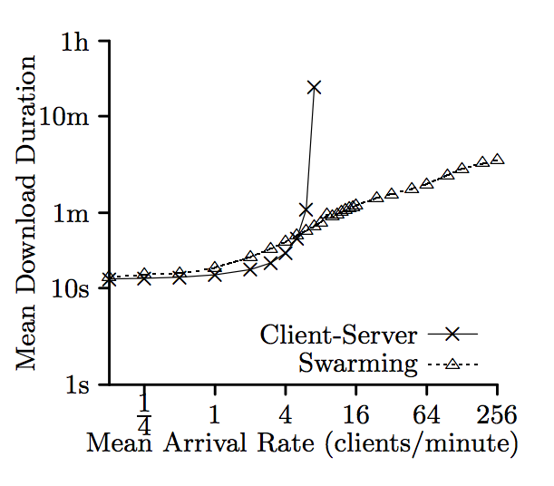
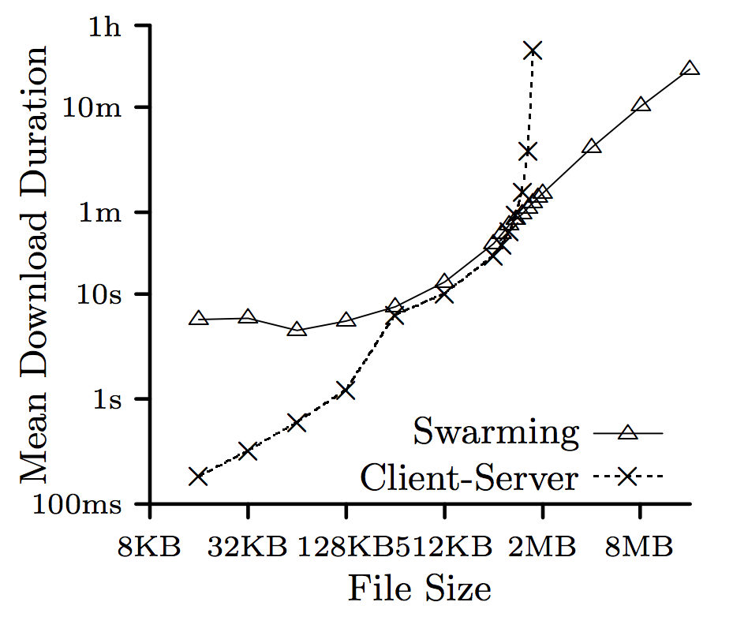

# Opdracht 1 - Peer-To-Peer

### a) Can you mention some other popular P2P file sharing protocols?

Een aantal andere populaire P2P protocollen zijn:
- *Gnutella*, deze wordt o.a. gebruikt door BearShare en LimeWire);
- *Bitcoin*, bekend van uiteraard Bitcoin;
- *FastTrack*, gebruikt door o.a. Kazaa.

### b) What are the stakeholders in a peer-to-peer network like XChange? What are their concerns?

Er zijn een aantal stakeholders betrokken bij het project met verschillende belangen. Ze staan hieronder opgesomd.
- Opdrachtgever
	- autonomy: de opdrachtgever verwacht dat het systeem zonder tussenkomst van een administrator zal werken;
	- afordability: de opdrachtgever ontwerpt een systeem voor studenten, dus het moet betaalbaar zijn.
	- efficiency: het moet een betaalbaar systeem zijn, dus het zal zo efficient mogelijk om moeten gaan met de resources.
- Gebruikers
	- availability: het is belangrijk dat de bestanden altijd beschikbaar zullen zijn;
	- dependability: het moet een systeem worden, waarop te vertrouwen is; een systeem dat niet telkens faalt wanneer het nodig is;
	- usability: voor de gebruiker, en zeker voor studenten, is het belangrijk dat het systeem eenvoudig is in gebruik.

### c) What are the advantages and disadvantages of P2P filesharing compared to client/server file sharing? Discuss at least the 5 major perspectives (from the SSA book).

### d) Why do P2P networks have excellent scalability? Give numerical examples and graphs to support your answer.

Bij een client/server netwerk is de grootste bottleneck de capaciteit van de server. Wanneer het aantal clients verdubbeld, moet de server zijn resources verdelen over het dubbele aantal clients. Dat betekent dat iedere client in plaats van, bijvoorbeeld, 1024 MB/s tot zijn beschikking heeft, dat het maar 512 MB/s to zijn beschikking heeft. Dat is bij P2P niet het geval. Bij een P2P netwerk wordt gecontroleerd wie het bestand aanbiedt. Degene die het bestand het snelste kan leveren, zal het bestand vervolgens leveren. Bij het P2P netwerk geldt dus: wanneer het aantal peers verhoogd, zal de beschikbaarheid van bestanden verhoogd worden en de snelheid waarmee een bestand gedownload wordt, minder snel oplopen dan bij een client/server bestandsdeling. Dat is ook terug te zien in onderstaande grafiek.

Daarnaast is de bestandsgrootte van invloed op de downloadsnelheid. Bij een client/server bestandsdeling is de impact van de bestandsgrootte echter veel groter dan bij een P2P bestandsdeling. Uiteraard is de benodigde tijd voor het downloaden van een groter bestand meer dan bij een kleiner bestand. Maar bij een client/server bestandsdeling stijgt deze tijd exponentieel, terwijl deze bij P2P lineair stijgt. Zie hiervoor ook onderstaande grafiek.

### e) Explain in what way the integrity of (shared) files is preserved.

Bij peer-to-peer is het niet noodzakelijk dat iedere peer over het volledige bestand beschikt. Het kan voorkomen dat een peer maar de helft van een bestand heeft, omdat de andere helft corrupt is. De integriteit van het bestand kan dan nog steeds gewaarborgd worden. Een andere peer kan namelijk over de tweede helft van het bestand beschikken. Een derde peer kan dan bij beide andere peers de benodigde delen van het bestand ophalen en het bestand reconstrueren.

Bij een client/server is dit niet mogelijk. Wanneer een bestand corrupt is op de server, kan het bestand niet gerecontrueerd worden, omdat er maar 1 versie van beschikbaar is.

### f) Explain what is meant by torrent index and tracker. And why is it difficult to forbid torrent indexes and trackers?

Een tracker is een HTTP(S) service die gebruikt wordt om te managen waar de peers zich bevinden. Peers weten in principe niet van elkaars bestaan af. Wanneer een peer zich aanmeldt bij de tracker, communiceert het over welke bestanden/bestandsdelen het beschikt. Wanneer een andere peer om een bestand/bestandsdeel vraagt bij de tracker, koppelt de tracker deze twee peers met elkaar, zodat de bestandsoverdracht kan plaatsvinden.

Een torrent index is een index van bestanden die potentieel toegankelijk zijn via het peer-to-peer netwerk. Het is dus in wezen vergelijkbaar met een index van woorden achter in een boek. Het geeft precies aan welk bestand bij welke peer gevonden kan worden.

Het is niet verboden om de locatie van een bestand op te slaan. Daarnaast is het ook niet verboden om, wanneer een gebruiker daar toestemming voor gegeven heeft, op te slaan waar deze zich bevindt. Zeker niet als dit maar tijdelijk opgeslagen wordt. Het is dus heel moeilijk om torrent indici en trackers te verbieden.

### g) Evaluating availability, what are in your opinion the weak points in the architecture of the protocol ?

### h) Can you think of a design pattern that is comparable to the role of a tracker in the bittorrent protocol ?

### i) Can you imagine how the architecture of bittorrent could be applied to a complex application or system ? If so, give an example.

### j) Explain in your own words the working of a bittorrent peer-to-peer system by drawing deployment and sequence diagrams. Supplement the drawings with text. Go into depth about which data is on which node, hashes, etc.

