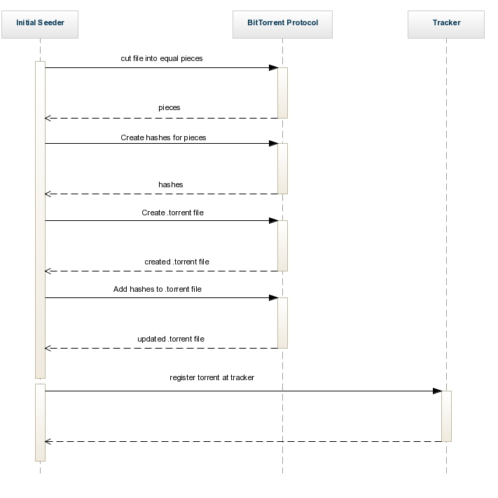
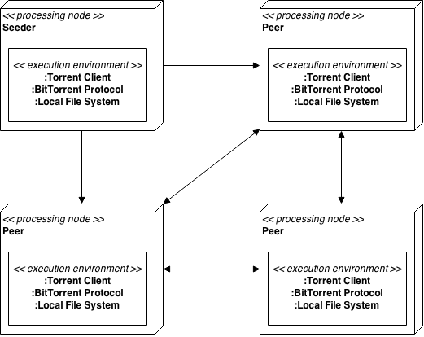

# Opdracht 1 - Peer-To-Peer

__a) Can you mention some other popular P2P file sharing protocols?__

Een aantal andere populaire P2P protocollen zijn:
- *Gnutella*, deze wordt o.a. gebruikt door BearShare en LimeWire);
- *Bitcoin*, bekend van uiteraard Bitcoin;
- *FastTrack*, gebruikt door o.a. Kazaa.

__b) What are the stakeholders in a peer-to-peer network like XChange? What are their concerns?__

Er zijn een aantal stakeholders betrokken bij het project met verschillende belangen. Ze staan hieronder opgesomd.
- Opdrachtgever
	- autonomy: de opdrachtgever verwacht dat het systeem zonder tussenkomst van een administrator zal werken;
	- afordability: de opdrachtgever ontwerpt een systeem voor studenten, dus het moet betaalbaar zijn.
	- efficiency: het moet een betaalbaar systeem zijn, dus het zal zo efficient mogelijk om moeten gaan met de resources.
- Gebruikers
	- availability: het is belangrijk dat de bestanden altijd beschikbaar zullen zijn;
	- dependability: het moet een systeem worden, waarop te vertrouwen is; een systeem dat niet telkens faalt wanneer het nodig is;
	- usability: voor de gebruiker, en zeker voor studenten, is het belangrijk dat het systeem eenvoudig is in gebruik.

__c) What are the advantages and disadvantages of P2P filesharing compared to client/server file sharing? Discuss at least the 5 major perspectives (from the SSA book).__

__d) Why do P2P networks have excellent scalability? Give numerical examples and graphs to support your answer.__

Bij een client/server netwerk is de grootste bottleneck de capaciteit van de server. Wanneer het aantal clients verdubbeld, moet de server zijn resources verdelen over het dubbele aantal clients. Dat betekent dat iedere client in plaats van, bijvoorbeeld, 1024 MB/s tot zijn beschikking heeft, dat het maar 512 MB/s to zijn beschikking heeft. Dat is bij P2P niet het geval. Bij een P2P netwerk wordt gecontroleerd wie het bestand aanbiedt. Degene die het bestand het snelste kan leveren, zal het bestand vervolgens leveren. Bij het P2P netwerk geldt dus: wanneer het aantal peers verhoogd, zal de beschikbaarheid van bestanden verhoogd worden en de snelheid waarmee een bestand gedownload wordt, minder snel oplopen dan bij een client/server bestandsdeling. Dat is ook terug te zien in onderstaande grafiek.

Daarnaast is de bestandsgrootte van invloed op de downloadsnelheid. Bij een client/server bestandsdeling is de impact van de bestandsgrootte echter veel groter dan bij een P2P bestandsdeling. Uiteraard is de benodigde tijd voor het downloaden van een groter bestand meer dan bij een kleiner bestand. Maar bij een client/server bestandsdeling stijgt deze tijd exponentieel, terwijl deze bij P2P lineair stijgt. Zie hiervoor ook onderstaande grafiek.

__e) Explain in what way the integrity of (shared) files is preserved.__

Bij peer-to-peer is het niet noodzakelijk dat iedere peer over het volledige bestand beschikt. Het kan voorkomen dat een peer maar de helft van een bestand heeft, omdat de andere helft corrupt is. De integriteit van het bestand kan dan nog steeds gewaarborgd worden. Een andere peer kan namelijk over de tweede helft van het bestand beschikken. Een derde peer kan dan bij beide andere peers de benodigde delen van het bestand ophalen en het bestand reconstrueren.

Bij een client/server is dit niet mogelijk. Wanneer een bestand corrupt is op de server, kan het bestand niet gerecontrueerd worden, omdat er maar 1 versie van beschikbaar is.

__f) Explain what is meant by torrent index and tracker. And why is it difficult to forbid torrent indexes and trackers?__

Een tracker is een HTTP(S) service die gebruikt wordt om te managen waar de peers zich bevinden. Peers weten in principe niet van elkaars bestaan af. Wanneer een peer zich aanmeldt bij de tracker, communiceert het over welke bestanden/bestandsdelen het beschikt. Wanneer een andere peer om een bestand/bestandsdeel vraagt bij de tracker, koppelt de tracker deze twee peers met elkaar, zodat de bestandsoverdracht kan plaatsvinden.

Een torrent index is een index van alle torrents die te downloaden zijn. Binnen een torrentbestand ligt vervolgens opgeslagen welke trackers beschikbaar zijn voor dit bestand.

Het is niet verboden om de locatie van een bestand op te slaan. Daarnaast is het ook niet verboden om, wanneer een gebruiker daar toestemming voor gegeven heeft, op te slaan waar deze zich bevindt. Zeker niet als dit maar tijdelijk opgeslagen wordt. Het is dus heel moeilijk om torrent indici en trackers te verbieden.

__g) Evaluating availability, what are in your opinion the weak points in the architecture of the protocol?__
De peers in het peer-to-peer netwerk zijn heel vluchtig. Het komt vaak voor dat wanneer een peer een bestand heeft gedownload, dat het de verbinding sluit. Daardoor daalt de beschikbaarheid voor andere peers in het netwerk. Wanneer het totale aantal peers in een netwerk hoog genoeg is, is de fluctuatie in het aantal peers niet zo sterk merkbaar. Maar wanneer het aantal peers in een P2P-netwerk wat lager is, neemt de beschikbaarheid van een bestand dus ook af.

__h) Can you think of a design pattern that is comparable to the role of a tracker in the bittorrent protocol?__
Het Broker Pattern is enigszins vergelijkbaar met de rol van de tracker in het bittorent protocol. Het Broker Pattern wordt gebruikt bij gedistribueerde applicaties. Het broker component is, net als de tracker, verantwoordelijk voor het coördineren van de communicatie.

__i) Can you imagine how the architecture of bittorrent could be applied to a complex application or system? If so, give an example.__
Ja, het kan gebruikt worden in applicaties/systemen met een grote hoeveelheid data verdeeld over meerdere servers. Je zou daarbij kunnen denken aan een systeem op de schaal van Facebook. Facebook beschikt namelijk over een zeer grote hoeveelheid data die over meerdere servers gedistribueerd moet worden. Wanneer een post of update op één van de servers opgeslagen wordt, moet daar een backup van gemaakt worden op alle servers. Dit kan gedaan worden door vanuit die ene server, waar de post/update op is opgeslagen, de post/update direct naar alle andere servers te distribueren. Dit heeft een aantal nadelen:

1. Het kost de server veel dataverkeer om 1 post naar alle servers te backuppen;
2. Het kost veel tijd voor die ene server om een update die in China is gedaan, op te slaan op een server in Amerika;
3. Een server die veel gebruikt wordt, is ook veel tijd kwijt aan het synchroniseren van de gegevens naar alle andere servers.

Dit kan opgeslost worden door het via torrents te distribueren. Door de updates via torrents te distribueren, wordt de load over alle servers (ongeveer) gelijk verdeeld. Daarmee voorkom je overbelasting van een specifieke server en is de post/update ook sneller verdeeld over alle andere servers.

Meer informatie hierover kan geworden op [TorrentFreak](http://torrentfreak.com/facebook-uses-bittorrent-and-they-love-it-100625/ "Facebook using BitTorrent") en [Wikipedia](http://en.wikipedia.org/wiki/BitTorrent#Others "Facebook using BitTorrent").

__j) Explain in your own words the working of a bittorrent peer-to-peer system by drawing deployment and sequence diagrams. Supplement the drawings with text. Go into depth about which data is on which node, hashes, etc.__

De vraag is dubbelzinnig gesteld: er wordt gevraagd om in eigen *woorden* uit te leggen hoe een bittorrent peer-to-peer systeem werkt, door diagrammen te *tekenen*. Aangezien de diagrammen door onszelf (dus met eigen "woorden") gemaakt zijn, gaan we er vanuit dat de tekeningen op zich volstaan om deze vraag te beantwoorden.

In onderstaand diagram wordt uitgelegd hoe een seeder ontstaat. Deze beschikt over een bestand en meldt zich aan bij de tracker, zodat het bestand met andere peers gedeeld kan worden. Door een compileerfout ontbreekt de return message van de tracker naar de seeder. Hier had *success message* moeten staan.

In onderstaand diagram wordt uitgelegd hoe het delen van een bestand via het bittorrent protocol werkt.

Onderstaand diagram is een deployment diagram. Hierin is terug te vinden welke software op de verschillende componenten binnen het netwerk draait. Om het overzicht te behouden is onderstaand diagram een vereenvoudigd model.

