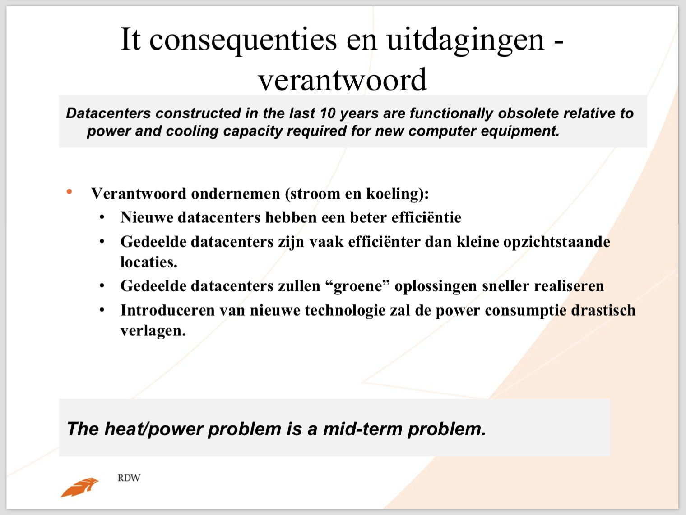

# Opdracht 2

## Deel 1

Deze antwoorden zijn gebaseerd op [Enterprise Architecture for Systems Engineers by IBM](http://www.ibm.com/developerworks/rational/library/edge/09/jun09/enterprisearchitecture/).

__a) Explain in your own words what "stovepipe systems" are (p.1).__

De term "stovepipe systems" (kachelpijp systeem) refereert naar een antipatroon in softwareontwikkeling, waarbij er een deel zichtbaar is voor de buitenwereld, maar het echte werk binnen gebeurd. Hiermee is er maar een beperkt deel van de functionaliteit zichtbaar/bruikbaar voor anderen en zijn dingen zoals (data)opslag volledig losgekoppeld - en kan dit niet makkelijk worden gedeeld met anderen. Een voorbeeld is een systeem waarbij elk component een eigen database gebruikt voor gebruikersauthorisatie. Waardoor er nieuwe problemen, zoals redundantie van gebruikersaccounts, ontstaan.

Een voordeel van een kachelpijp systeem is zelfstandigheid, wat inhoudt dat er geen afhankelijkheden zijn met andere componenten. Waardoor de zogeheten "depedency hell" voorkomen kan worden.

__b) Explain in your own words what "business/IT alignment" is (p.1).__

Naarmate de IT wereld groeide is het steeds belangrijker geworden dat de IT architectuur aansluit op de doelstellingen van het bedrijf, waardoor uitgaven aan het systeem verantwoord kunnen worden door bijbehorende zakelijke voordelen. Business/IT alignment is het afstemmen van deze zakelijke doelstellingen. Dit wordt gedaan door de system engineers eerder te betrekken in het ontwikkelproces en wijzigingen gedreven te laten worden door metingen (analyse) en feedback.

Deze manier zorgt voor verbeterde transparantie en tracht de system engineers en de mensen van het management op één lijn te brengen. Dit door het niveau van betrokkenheid en communicatie te verhogen, waardoor er minder met de vinger wordt gewezen maar een ieder zijn of haar verantwoordelijkheid heeft in de gemaakte keuzes.

__c) Explain in your own words what "governance" is (p.1).__

Governance is bestuur en en deze context het technisch bestuur omtrent het systeem. Denk hierbij aan het sturen in het maken van keuzes vanuit een technisch perspectief. De system engineers kunnen hierin bijdragen door aan het management te laten zien welke impact bepaalde keuzes hebben op zowel projectniveau als op het niveau van de enterprise architectuur.

Door elke stap van het ontwikkelproces (het ontwerpen, bouwen, en eventueel aanpassen of uitbreiden van het systeem) ook vanuit een technisch oogpunt te bekijken, kunnen er bij voorhand problemen worden voorzien. Doordat bepaalde keuzes technische implicaties kunnen hebben en hier vroegtijdig een oplossingen voor gevonden kan worden, is de impact van deze aanpassingen laag en daarmee ook goedkoop ("cheap").

__d) Explain in your own words the relationship between programs and projects (p.3).__

Zoals in het artikel beschreven is een program (programma) een initiatief dat wordt ondernomen om de staat van de enterprise te wijzigen door het bieden van een nieuwe of verbeterde capaciteit. En zoals beschreven is een project een ontwikkelactiviteit met een specifieke focus, begin, en eind, met als doel om een meetbaar resultaat te leveren dat bijdraagt aan de capaciteit van het programma.

De relatie is goed te zien in _Figure 2: How programs and projects affect the enterprise_. Waarin te zien is dat een programma meerdere projecten kan overkoepelen. Het programma is het einddoel, waarbij de projecten het middel zijn om dit doel te realiseren. Een programma kan in scope variëren van het aanpassen van een enkel aspect tot het wijzigen van de gehele business. Projecten implementeren het programma.

De artefacten die programma's leveren verschillen van die van de projecten. Beide leveren deltas omtrent requirements, architectuur, en testen plus nieuw gevonden defecten. Echter is dat bij een programma op enterprise niveau en bij een project op systeemniveau.

## Deel 2

Intro: _The RDW ("Dienst Wegverkeer", www.rdw.nl) is a Dutch governmental organization which registers cars, drivers licenses, etc. They currently have a large legacy base on mainframe/Cobol (both databases and applications). One of their programs, which is called Platform Independence, is to migrate from the mainframe to a Microsoft platform._

De volgende presentatie is gebruikt bij het antwoorden van de vragen: https://www.ngi-ngn.nl/Regios/Noord/Verslagen/Lezing-RDW-succesvol/Bijlagen/1-juli-14-presentatie-over-Westpoort-datacenter-verhuizing-public.pdf.

__e) Give three reasons why the RDW would want to migrate away from the mainframe.__

1. Voor een modern, geïntegreerd, multi-platform, en op PC's gebaseerde ontwikkelomgeving;
2. Om alle ontwikkeltools en mutli-platform processen te integreren in een gecontroleerde omgeving;
3. Om de fundering te leggen voor een toekomstige modernisering van de IT binnen het bedrijf.

Bron: http://www.d-s-t-g.com/en/customers/references/trade-and-public-administration/rdw.html#3

__f) Give two reasons why the RDW would *not* want to migrate away from the mainframe.__

1. De risico's die zijn verbonden aan het migratietraject. Zo kan er ongemak ontstaan voor de klanten, door bijvoorbeeld verlies van data of incorrect werkende functionaliteit (bijv. door compatibiliteitsproblemen). Dit kan zowel tijdens als na de migratie voorkomen;

2. Ook kunnen er aannames en veronderstellingen worden gedaan zonder deze correct te toetsen/testen. Dit kan ontstaan door bijvoorbeeld ontbrekende specifieke kennis van interne medewerkers. Ook kunnen de prestaties tegenvallen (bijv. energieverbruik ten opzichte van verwerkingssnelheden) en zal ook hiervoor een oplossing gevonden moeten worden. Tot slot kan het migratietraject meer tijd/geld kosten dan verwacht. Waardoor het resultaat mogelijk niet opweegt tegen de kosten.

__g) Which one of the strategic goals on https://www.rdw.nl/overrdw/Paginas/Strategische-doelstellingen.aspx is the main driver for this program?__

Het achterliggende strategische doel voor de migratie is: _Nieuwe taken uitvoeren die het publieke belang dienen, zowel in de mobiliteitsketen als op het gebied van veiligheid en milieu._

De migratie naar een modern Windows platform vereenvoudigd het uitvoeren van nieuwe taken en dient in het publieke belang vanwege de volgende aspecten:

- Stabiliteit van het systeem - het mag niet zo zijn dat er bij een wijziging of toevoeging een deel van het systeem stopt met functioneren. Bij het opnieuw inrichten van een infrastructuur kunnen er nieuwere, en mogelijk stabielere versies van, softwarepakketten worden gebruikt. Ook kunnen hierdoor oude beveiligingslekken worden gedicht;
- Eenvoud voor ontwikkelaars - het implementeren van nieuwe functionaliteit mag geen moeilijke taak zijn. Hierbij geldt in het geval van het RDW dat er steeds minder (goede) Cobol ontwikkelaars zijn. En dat deze uiteraard steeds duurder worden vanwege hun expertise in een niche. Door een te complex ontwikkelproces kan vooruitgang stagneren. [C# van .NET wint daarentegen steeds meer aan populariteit](http://www.windowscentral.com/c-trend-2014);
- Mobiliteit en schaalbaarheid - waarbij de stijgende groei in gebruik (zie voorgaande link naar presentatie) geen problemen mag veroorzaken, wat kan worden gegarandeerd door een moderne en schaalbare infrastructuur.

Bij de migratie wordt er ook rekening gehouden met de CO2 footprint van het RDW. Het RDW is zich goed bewust van de impact die ze hebben op het milieu. De onderstaande grafiek beschrijft de huidige CO2 footprint:

| Emissiebron        | 2013      | 2012      | 2011      | Verschil 2012-2013 |
| :----              | :----     | :----     | :----     | :----              |
| Aardgas            | 1.844     | 1.618     | 1.527     | 14,0%              |
| Elektriciteit      | 2.803     | 2.501     | 2.073     | 12,1%              |
| Transportbrandstof | 2.051     | 2.028     | 1.864     | 1,2%               |
| OV-kilometers      | 30        | 33        | 15        | -7,7%              |
| Koelvloeistof      | -         | -         | -         | -                  |
| Afval              | 224       | 188       | 181       | 19,4%              |
| Kerosine           | 261       | 351       | 329       | -25,5%             |
| Papier             | 285       | 308       | 345       | -7,2%              |
| __Totaal__         | __7.498__ | __7.025__ | __6.334__ | __6,7%__           |

De volgende afbeelding komt uit de hiervoor genoemde presentatie:

Het migratietraject zal een infrastructuur opleveren die zuiniger is in energieverbuik, wat het milieu direct ten goede komt. Het moge duidelijk zijn dat het RWD verantwoord wil ondernemen en hier ook rekening mee houdt bij het maken van keuzes.

__h) Think of three possible projects that could be part of the program Platform Independence.__

In de eerder genoemde presentatie wordt het migratietraject beschreven (slide 44). De individuele acties kunnen worden opgedeeld in de drie fases:

- Voorbereiding
	- Samenwerkingsverband opgericht met Noordelijke (semi-)overheden
	- Gezamenlijke aanbesteding om de bouw van het nieuwe Westpoort datacenter in Groningen te realiseren
	- Op vrijwillige basis participeren in het landelijke datacenter consolidatie programma van de centrale overheid
	- Westpoort computervloer gereed maken voor het inhuizen van de RDW systemen
	- Westpoort locatie redundant koppelen aan het RDW netwerk
	- Verhuis- en migratieplannen maken / Voorbereiden op verhuizing
- Migratie
- Afronding
	- Rozenburg computervloer ontmantelen (ICT technisch niet EW installatie)
	- Realisatie beperkte computerruimte voor Test/Winframe witness/Tape/PKI
	- Procedures aanpassen aan Westpoort <> Zernike combinatie

Omdat de, hiervoor te ondernemen, acties op een dusdanig grote schaal worden uitgevoerd, kan elke actie als project worden beschouwd. Een drietal projecten zijn:

1. Westpoort computervloer gereed maken voor het inhuizen van de RDW systemen (1200 servers, 136 actieve netwerkcomponenten) en het redundant koppelen van deze locatie aan het RDW netwerk. Het meetbare resultaat van dit project is een fysieke basisinfrastructuur voor de uiteindelijke verhuizing/migratie;
2. Realisatie beperkte computerruimte voor Test/Winframe witness/Tape/PKI. Het resultaat is de gerealiseerde infrastructuur voor het uitvoeren van de testen en backups, waarbij er veel rekening moet worden gehouden met beschikbaarheid (plannen voor terugvallen bij uitval);
3. Procedures aanpassen aan combinatie van Westpoort en Zernike. De combinatie van nieuwe afspraken en de nieuwe locatie vereist dat bepaalde procedures worden aangepast, hiervoor moeten de veranderingen en hun impact in kaart worden gebracht. Het resultaat hiervan zijn de bijgewerkte artefacten.
