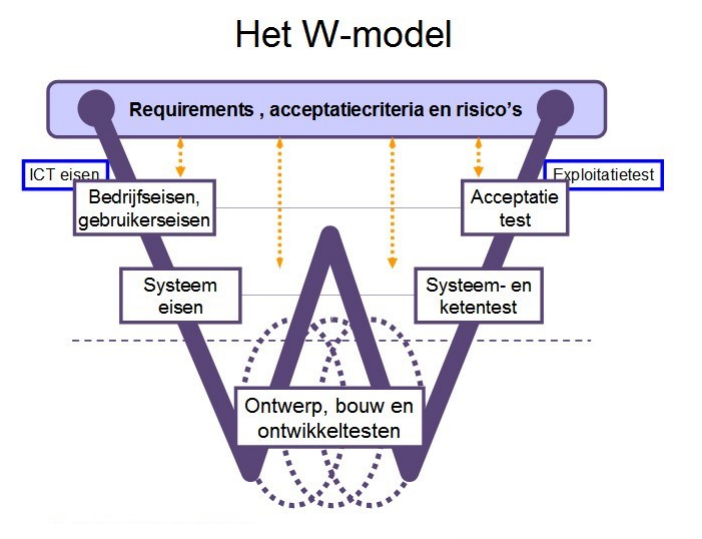
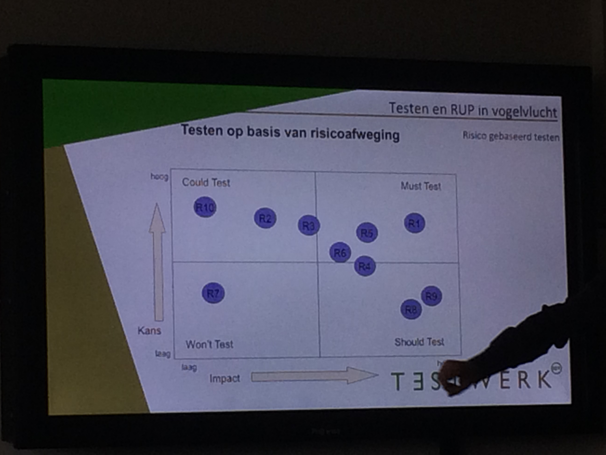
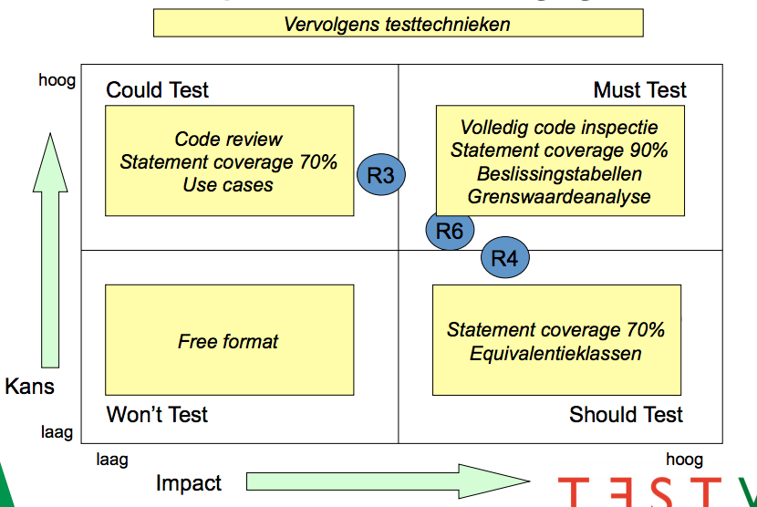

# Notes Gastcollege Testwerk

__Datum:__ Friday November 28th 2014

## Wat is testen
__Definitie:__ *"Vaststellen of iets werkt conform specificatie."*

__T-Map Next definitie:__ *"Testen is een proces dat inzicht geeft in - en adviseert over de kwaliteit en de daaraan gerelateerde risico's"*

Testen is ook "creatief". --> Iets van verschillende kanten kunnen benaderen.

### Waarom Testen
Inzicht krijgen in kwaliteit

*Voorkomen van schade*, afwegen van risico's

Advies geven/krijgen voor in productie name

*Vertrouwen* en draagvlak kweken

Testen *hoeft* niet. Waar geen risico in zit, hoef je niet te testen. Het is een afweging tussen het risico dat je wilt lopen en het risico dat je kunt lopen.

### Testobjecten:
- Hardware
- Systeemsoftware
- Applicatiesoftware
- Conversiesoftware
- (Bedrijfs-)processen
- Documentatie
- Implementatie (-draaiboek)

### W-model

### Welke aspecten

| Aspect          | Attributen                                                               |
| ----            | -----------------                                                        |
| Portability     | Adaptablilty, installibility, co-existence, replaceability, compliance   |
| Efficiency      | (__Time behavior__) Performance, Resouce utilization, compliance         |
| Reliability     | Maturity, fault-tolerance, recoverability, compliance                    |
| Functionality   | Suitablility, Accuracy, __Security__, interoperability, Compliance       |
| Usability       | Understandability, Learnability, Operability, Attractiveness, Compliance |
| Maintainability | Analyzability, Changeability, Stability, Testability, Compliance         |

### Risico gebaseerd testen

Risico identificatie: bepaal per functionaliteit welke risico's er gelden (voorbeeld 10 risico's)

Bepaal per risico kans dat het optreedt
- complexiteit
- nieuwe ontewikkeling
- interfaces
- technologie
- ervaring van bouwers

Bepaal per risico de impact
- Belang van gebruikers
- ...
- ...

### Testtechnieken

Statische testen (zonder de te testen software uit te voeren)
- Reviews
- Analyse

Dynamische testen (de te testen software wel uitvoeren)
- Structure bases (white box)
- Experience based
- Specification based (black box)

Use Case Testing
- Compleet stuk functionaliteit met concreet resultaat

Exploratory Testing
- Systeem stapj voor stap ontdekken en dan ter plekke testen
- Testontwerp tijdens testuitvoer

Goedpaden en foutpaden
- Gedefinieerde foutsituaties aflopen

Gegevens- of procescyclustest
- Flow van gegevens door het systeem met alle afslagen
- Volledige proces van systeem en inpasbaarheid in bedrijfsproces

### Testtools
- Testautomatisering
	- Wegnemen van herhalende taken bij tester
	- Regressietesten / Record & playback
	- Load & performancetesten

- Testuitvoering
	- Inschieten van berichten
	- Tools om input/output te bekijken
	- Bekijken van wijzigingen in systeem (database)
	- Stubs en Drivers (*__Stubs --> opzoeken__*)

- Ondersteunende tools
	- Vastleggen *testgevallen*
	- Vastleggen *bevindingen*

## Wat is RUP

## Fases
- __Inception__, focus op *scope*
- __Elaboration__, focus op *risico's*
- __Construction__, focus op *bouw*
- __Transition__, focus op *overdracht*

## Fases versus disciplines

## Disciplines en rollen

## Teamsamenstelling

## Iteraties en releases
