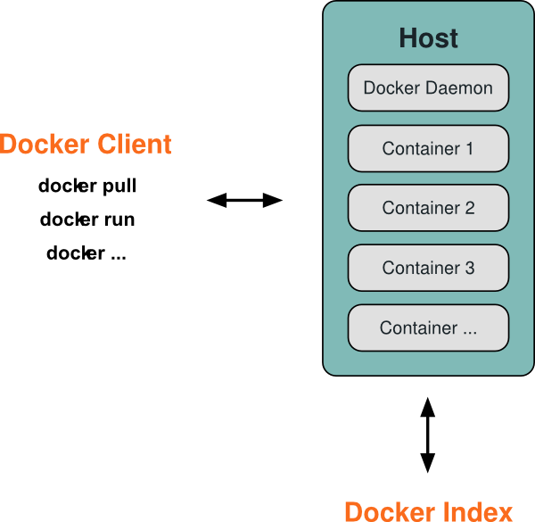

# Architectuur van Docker

Voor het gebruik zijn de volgende dingen nodig:

- Een computer of server met een Linux besturingssysteem (de 'host');
- De Docker software (waarin LXC is inbegrepen);
- Optioneel: een internet verbinding voor het gebruik van Docker Hub.

Het concept van Docker is vrij eenvoudig. Er draait een applicatie op de achtegrond die de images en containers beheert. Deze applicatie wordt aangestuurd met behulp van een command line tool (zie ook paragraaf Testconfiguratie [[LINK]]). Tot slot is er de Docker Index, dit is de lijst met images die wordt aangeboden door de Docker Hub. De command line tool helpt ook bij het binnenhalen van images van de Docker Hub en het opslaan van eigen gemaakte images.

Het volgende figuur laat zien hoe Docker is opgebouwd:



De zogeheten 'Docker Daemon' is de centrale applicatie die in de achtergrond draait. Deze 'client-server' architectuur biedt een eindpunt alle zaken omtrent Docker worden aangestuurd. Dit stelt tools als _Boot2docker_ in staat om van buitenaf te communiceren en Docker aan te sturen.

De command line tool kan op zijn beurt communiceren met dit eindpunt, om zo containers op te zetten (aan de hand van de images), te starten, te stoppen, te inspecteren etc. Verder kan deze tool images ophalen via de Docker Index. Zoals in de afbeelding te zien, gaat dit via de Docker Deamon. Tevens kunnen images worden opgeslagen in de Docker Hub.

Het publiceren van deze image betekend ook dat een ieder ander het kan hergebruiken. Het is ook mogelijk een eigen (privé) Docker register op te zetten, wat handig is bij het werken met gevoelige informatie en waarmee de huidige beveiligingsproblemen worden geëlimineerd.


```
Bronnen:
- http://docs.docker.com/introduction/technology/

Architectuur
- Docker Index = Docker Hub register (lijst met containers)

- Docker daemon;
- Docker client, and;
- Docker.io registry.
- Images
- Dockerfiles
- Containers

- Docker is a client-server application.
- Both the Docker client and the daemon can run on the same system, or;
- You can connect a Docker client with a remote Docker daemon.
- They communicate via sockets or through a RESTful API.
- Users interact with the client to command the daemon, e.g. to create, run, and stop containers.
- The daemon, receiving those commands, does the job, e.g. run a container, stop a container.
```