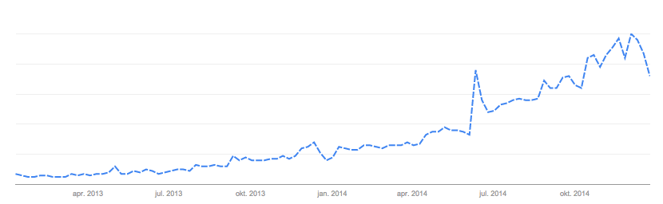

# Wat is de maturity van Docker en de community er omheen?

Docker is in maart 2013 gelanceerd en dus nog vrij jong. Daaruit zou de conclusie getrokken kunnen worden dat Docker nog veel kinderziektes heeft en nog niet klaar is voor de 'grote' markt. Toch vertellen de cijfers in de praktijk ons iets anders. Dit onderdeel zal wat dieper ingaan op de maturity (volwassenheid, mate van gevorderdheid van ontwikkeling) van Docker en de community er omheen.

Zoals in het hoofdstuk 'welke bedrijven gebruiken Docker' [[LINK]] blijkt, zijn er veel toonaangevende bedrijven die gebruik maken van Docker. Daarin is te zien dat partijen als Yelp, Spotify en Ebay gebruik maken van Docker. Dergelijke bedrijven maken geen gebruik van een platform dat nog niet ver genoeg ontwikkeld is om gebruikt te kunnen worden. Hieruit kan dus geconcludeerd worden dat Docker die mate van maturity heeft bereikt dat het gebruikt kan worden door grote bedrijven. Uit de statistieken van Alexa blijkt ook, dat zo'n 60 á 70% van de bezoeker van Docker.com de website vanaf kantoor bezoekt.

Andere interessante cijfers die we kunnen bekijken zijn die van Github, Stackoverflow, Alexa en Google. Zoals in onderstaande grafiek te zien is, is de populariteit van Docker enorm toegenomen, met name in het jaar 2014.



Wanneer er gekeken wordt naar de statistieken van Github met betrekking tot Docker, dan zien we dat er (d.d. 24 december 2014) ruim 1,4K watchers zijn, bijna 18K stars zijn gegeven en ruim 3,6K forks zijn gedaan van de Docker repo. Daarnaast zijn er ruim 22K repositories die over Docker gaan. Dit in vergelijking met bijna 100K repos over NodeJS. De initiële versie van NodeJS is in mei 2009 gelanceerd. Dat betekent dat NodeJS ongeveer 4,5 jaar bestaat. Docker bestaat 1,5 jaar. Wanneer Docker met dezelfde snelheid blijft groeien als afgelopen jaar, dan bereikt Docker dezelfde populariteit als NodeJS.

Op StackOverflow.com zijn er (d.d. 24 december 2014) ruim 5,6K topics over Docker. Dit geeft aan dat Docker een grote mate van interesse heeft onder de developers. Daarnaast toont Alexa.com ons dat tussen 24 september 2014 en 24 december 2014 met ruim 6,000 plaatsen is gestegen op de wereldwijde ranglijst.

Andere bijzondere feiten over de activiteiten van de community om Docker zijn opkomende evenementen, nieuwsberichten en de bijna dagelijkse activiteiten op het forum van Docker. In de komende periode zijn er 36 evenementen over Docker gepland in Azië, Europa, Noord- en Zuid-Amerika en zelfs op eilanden in de Grote Oceaan. Verder zien we dat Docker media 2014 ertoe is overgegaan om een adviespanel op te stellen, wat duidelijk aangeeft dat er een grote interesse en sterke ontwikkeling van de Docker community plaatsvindt.

Ook de ontwikkeling van Docker staat alles behalve stil. Uit andere statistieken van Github blijkt dat er nog steeds dagelijks commits plaatsvinden in de Docker repository op Github. Een ander feit waaruit de populariteit van Docker blijkt, is dat Docker op nummer 1 staat op de lijst van open source projecten in 2014.

## Conclusie
Een eerste gedachte zou kunnen zijn dat, omdat Docker nog maar 'pas' ontwikkeld is, Docker nog niet klaar is om mee te doen met de grote spelers. De cijfers spreken deze gedachte echter tegen. Docker is een populair product en wordt door grote partijen als Yelp, Spotify en Ebay gebruikt. Er kan dus geconcludeerd worden dat Docker een grote community heeft.

Er wordt echter nog volop ontwikkeld en nieuwe functionaliteiten toegevoegd aan Docker. Hoewel Docker dus een grote community heeft, kan het wel nog verder ontwikkeld worden. Dit betekent echter niet dat het product te 'onvolwassen' is om te gebruiken.

**Bij een tekort aan content kan het volgende nog gebruikt worden:**
- Chatbox: https://botbot.me/freenode/docker/
- Uitgebreide Docker user guide: https://docs.docker.com/userguide/

```

Bronnen:
- http://www.google.com/trends/explore#q=%2Fm%2F0wkcjgj&date=1%2F2013%2024m&cmpt=q
- https://www.docker.com/company/aboutus/
- http://en.wikipedia.org/wiki/Node.js
- https://github.com/search?utf8=%E2%9C%93&q=node
- https://github.com/docker/docker
- https://github.com/search?utf8=%E2%9C%93&q=docker
- https://github.com/search?utf8=%E2%9C%93&q=docker+created%3A%3E2014-01-01&type=Repositories&ref=advsearch&l=
- https://github.com/search?utf8=%E2%9C%93&q=docker+created%3A%3E2014-06-01&type=Repositories&ref=advsearch&l=
- http://stackoverflow.com/search?q=docker
- http://www.alexa.com/siteinfo/docker.com
- https://www.docker.com/community/events/
- https://forums.docker.com/top/daily
- https://www.docker.com/company/news/
- https://www.docker.com/community/governance/
- https://github.com/docker/docker/graphs/commit-activity
- http://www.alexa.com/siteinfo/docker.com#demographics
- http://opensource.com/business/14/12/top-10-open-source-projects-2014

```
