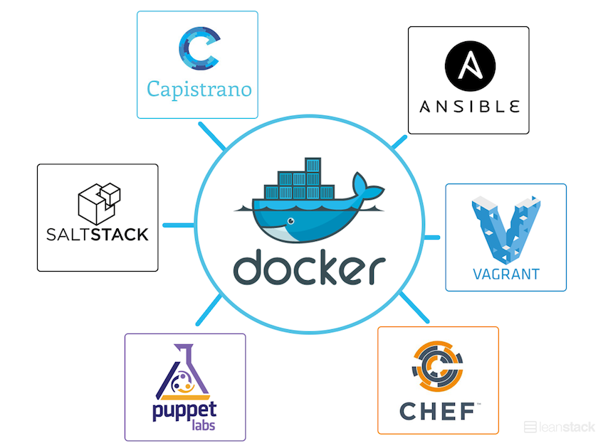

# Waar past Docker in het ontwikkelproces?

```
- Veel voorkomende problemen bij deployment.
- Hoe kan Docker helpen bij de problemen die zich voordoen?
```


- Infrastructuur
- Systeembeheerders
- Oplossing
	- Gelijke ontwikkelomgeving (aligned environments, door zelfde base image, die gegarandeerd overal hetzelfde is)
	- Gestandaardiseerde/uniforme aanpak
	- Deployments
- Schalen van applicatie
- In productie:
	- Grote deployments
	- Geautomatiseerde deployment op (nieuwe) server
	- Het inzetten van een backup bij uitval
- Kan ook samen werken met Chef, Puppet, Ansible etc.
	- Om elkaar te versterken
	- Process/application container



1. Weave
2. Kubernetes
3. Core OS/Flannen
4. Pipework
5. SocketPlane
6. Mezos


```
Bronnen:
- http://thenewstack.io/how-docker-fits-into-the-devops-ecosystem/
- http://www.informationweek.com/cloud/infrastructure-as-a-service/chef-finds-docker-a-close-fit/d/d-id/1297282
- http://recursivity.com/blog/2014/09/08/how-ansible-docker-fit-using-ansible-to-bootstrap-coordinate-docker-containers/
- http://www.wired.com/2014/06/eric-brewer-google-docker/
- http://computerworld.nl/beveiliging/84279-5-projecten-die-docker-completeren
```
