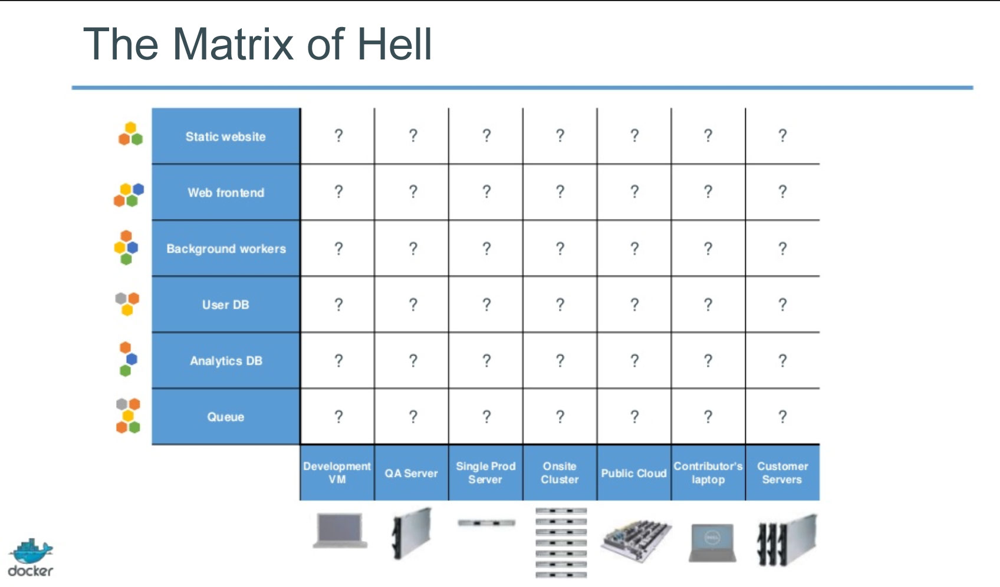

## Wat is Docker?

Docker is een open platform waarmee gedistribueerde applicaties kunnen worden gebouwd, getransporteerd en gerunt. Eén van de kenmerken van Docker is dat applicaties snel in elkaar kunnen worden gezet. Door gebruik van Docker kan de IT-afdeling binnen een bedrijf gemakkelijk overal dezelfde omgeving en apps draaien.

Docker bestaat uit twee 'onderdelen', namelijk de Docker Engine en de Docker Hub. De Docker Engine is een lichtgewicht packaging tool die makkelijk kan worden verplaatst. De Docker Hub is een cloud service die gebruikt wordt voor het delen van applicaties en automatiseren van workflows.

### Hoe werkt Docker?

Er wordt steeds meer verschillende software gebruikt, met verschillen versies en op verschillende hardware. Dit heeft geresulteerd in wat de founder van Docker (Solomon Hykes) de 'Matrix of Hell' noemt:



Deze complexiteit kan worden vergeleken met het transporteren van goederen. Er is een grote verscheidenheid aan afmetingen van producten die moeten worden vervoert. Hierbij kan worden gedacht aan bijvoorbeeld olievaten, kratten en auto's. Deze drie producten hebben allerlei verschillende afmetingen en bij het vervoeren dient rekening te worden gehouden met verschillende aspecten, zoals breekbaarheid en ontvlambaarheid. Deze producten kunnen vervoerd via verschillende transportmiddelen, zoals per schip, vliegtuig of vrachtwagen. In de praktijk kan dit dus voor veel compatibiliteitsproblemen zorgen.

De oplossing die hiervoor bedacht is, is een standaard over de afmetingen van het product dat getransporteerd wordt: de container. Wanneer de verschillende software/libraries worden vergeleken met de producten die moeten worden getransporteerd en de verschillende hardware componenten worden vergeleken met de transportmiddelen, zien we veel overeenkomsten. Dit is waar Docker voor kan worden gebruikt kan. De verschillende software kunnen worden gedraaid in zogenaamde containers. Docker biedt vervolgens voor alle soorten hardware een interface om deze container te kunnen laten draaien. Hiermee is een standaard ontwikkeld die het mogelijk maakt om op iedere hardware dezelfde software te kunnen draaien zonder compatibiliteitsproblemen.

Dit kan eenvoudigd worden bereikt door een Dockerfile te maken met daarin alle acties die moeten worden uitgevoerd, om zo een 'image' te maken. Een image is een read-only template, waarop bijvoorbeeld het besturingssyteem en de web applicaties staan geïnstalleerd. Met deze image kan vervolgens een container worden gemaakt. In het hoofdstuk over de 'leercurve van Docker' wordt hier ook verder over gesproken. [[LINK]]

Een Docker container kan vergeleken worden met een directory die alles bevat wat nodig is om een applicatie te kunnen draaien. Docker biedt de mogelijkheid om containers met elkaar te linken. Hierdoor onstaat de mogelijkheid om bijvoorbeeld de database in een aparte container te laten draaien. Dit maakt de afhankelijkheden tussen de verschillende container minder complex. Hoe groter en dynamischer het systeem, hoe meer tijdswinst dit oplevert.

Een image bestaat uit een aantal verschillende layers. Door gebruik te maken van het [union file system](http://en.wikipedia.org/wiki/UnionFS), worden deze verschillende layers gecombineerd tot één image. Hierin zit ook een van de redenen opgesloten dat Docker zo licht is. Wanneer iets aangepast wordt in één van de layers, hoeft de image niet in zijn geheel te worden verwijderd om vervolgens volledig te kunnen worden herbouwd. Enkel de nieuwe (of aangepaste) layer hoeft te worden toegevoegd (of aangepast).

Een image wordt opgebouwd door het uitvoeren van een aantal instructies. Elk van deze instructies bouwt een nieuwe layer. Deze instructies worden opgeslagen in de eerder genoemde Dockerfile.

```
Bronnen
- https://www.docker.com/whatisdocker/
- http://blog.docker.com/wp-content/uploads/2013/08/the_matrix_of_hell.jpg
- https://docs.docker.com/introduction/understanding-docker/
```
