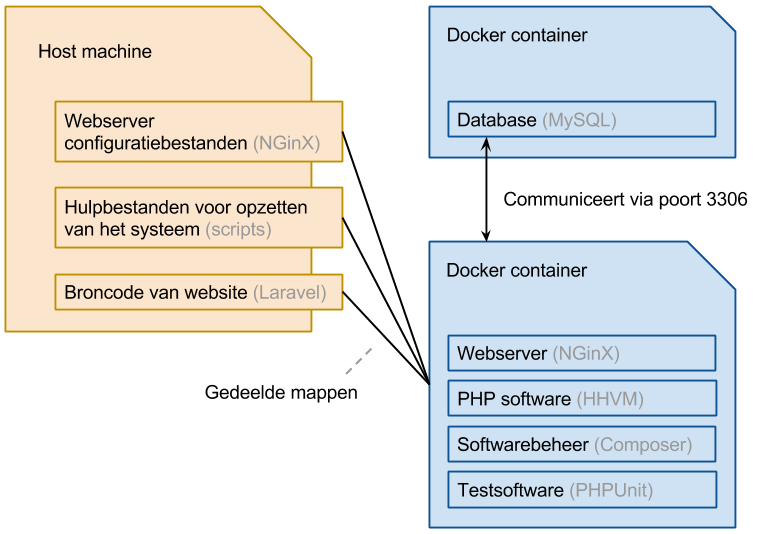

## Opzet testomgeving

Doordat er met Docker software in geïsoleerde containers kan worden gedraaid, is het eenvoudig om een testomgeving op te zetten zonder dat dit impact heeft op de ('host') machine van de gebruiker. Een veelvoorkomende opzet is een webserver met een database. Voor de testomgeving worden dan ook de volgende softwarecomponenten (ook wel 'stack' genoemd) gebruikt:

Deze opstelling demonstreert een groot aantal aspecten omtrent Docker:

- 
- Gebruik van bestaande images middels de Docker Index