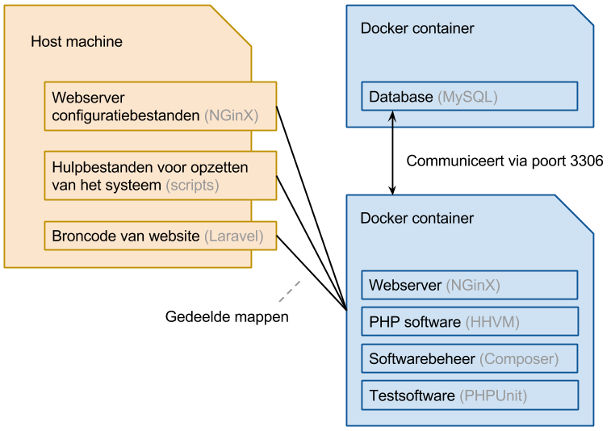

## Voorbeeld

Doordat er met Docker software in geïsoleerde containers kan worden gedraaid, is het eenvoudig om een testomgeving op te zetten zonder dat dit impact heeft op de machine van de gebruiker. Een veelvoorkomende opzet is een webserver met een database. Voor dit voorbeeld wordt de volgende softwarecomponenten (ook wel 'stack' genoemd) gebruikt:



### Stappen

Voor het opzetten van de softwarecomponenten kunnen de volgende stappen worden doorlopen. Let op dat hier kennis van de command line voor is vereist en dat het is uitgevoerd op een Unix besturingssysteem (Mac OS X).

1. Start een MySQL container vanaf de [bestaande image](https://registry.hub.docker.com/_/mysql/):

	```bash
	docker run \
		--name "db" \
		-d -p 3306:3306 \
		-e MYSQL_ROOT_PASSWORD=banaan \
		-e MYSQL_DATABASE=laravel \
		mysql
	```

2. Maak een `web/` map aan (`$ mkdir web/`) met deze bestanden die [hier te vinden zijn](https://github.com/MalcolmK/thema-4.2-se-leertaken/tree/master/onderzoek/demo/web). Deze _Dockerfile_ installeert de volgende software:

	- [NGinX](http://nginx.org/en/);
	- [HHVM](http://hhvm.com/), een snelle compiler voor PHP (~50% snelheidswinst);
	- Een PHP MySQL driver, om verbinding te kunnen maken met de database;
	- [Composer](https://getcomposer.org/), om Laravel te kunnen installeren/updaten;
	- [PHPUnit](https://phpunit.de/), voor het testen van de PHP code;
	- Een SSH server, om de container van binnen te kunnen bekijken.

3. Navigeer naar de `web/` map en draai `$ docker build -t="web" ." om een 'web' image te maken van de huidige directory (`./Dockerfile`).

4. Navigeer naar de bovenliggende map (`$ cd ../`).

5. Draai het volgende commando om een Laravel site op te zetten:

	```bash
	docker run \
		-it \
		-v $(pwd)/test:/var/www/html \
		-v $(pwd)/web/script:/var/script \
		web \
		/var/script/create.sh
	```

6. Start een web container en bewaar de container ID:

	```bash
	DOCKER_WEB_ID=$(docker run \
		--name "web" \
		-d \
		-p 80:80 \
		-p 2222:22 \
		-v $(pwd)/web/nginx:/etc/nginx/sites-enabled \
		-v $(pwd)/web/certs:/etc/nginx/certs \
		-v $(pwd)/web/logs:/var/log/nginx \
		-v $(pwd)/web/script:/var/script \
		-v $(pwd)/site:/var/www/html \
		--link db:db \
		web)
	```

	_Let op:_ In Windows is het resultaat van een commando opslaan (middels `$(..commando..)`) in een variabele (`VARIABELE=$(..commando..)`) niet mogelijk. Vervang daarom in de volgende stappen `$DOCKER_WEB_ID` met de uitvoer van het, in deze stap, uitgevoerde commando.

	Vervang op Windows ook `$(pwd)` met `%cd%`.

7. Verbind met de web container om de _NGinX_ log te zien:

	```bash
	docker attach --sig-proxy=false $DOCKER_WEB_ID
	```

8. Tot slot moet het IP adres van de server worden achterhaald om de website te openen. Bij een ander besturingssysteem dan Linux wordt er gebruik gemaakt van _Boot2docker_. Dit houdt in dat het IP adres van de virtuele machine moet worden gebruikt in plaats het IP adres van de container zelf. Dit kan worden gedaan met `boot2docker ip` (het van de container kan worden achterhaald met `docker inspect --format '{{ .NetworkSettings.IPAddress }}' "$DOCKER_WEB_ID"`).

9. Open tot slot het IP adres in een webbrowser om de website te bekijken.

### Overig

Dit voorbeeld geeft een inzicht in het opzetten van een ontwikkelomgeving met behulp van Docker. Afsluitend nog een aantal tips:

- __Layer caching:__ Bij het omzetten van een _Dockerfile_ naar een image worden alle 'RUN' commando's in aparte containers uitgevoerd. [Docker cached](https://docs.docker.com/articles/dockerfile_best-practices/#build-cache) op deze manier alle stappen van het 'build process', om bij het opnieuw bouwen van de image aanzienlijke snelheidswinst te behalen.

- __Herstarten container:__ Met het `$ docker start &lt;container ID&gt;` commando kan een gestopte container opnieuw worden gestart.

- __Toegang tot container:__ Er kan een andere versie van de container worden opgezet of een SSH server worden geïnstalleerd:

	1. De start opdracht van een container kan worden overschreven met het `$ docker -it run &lt;image&gt; /bin/bash` commando. Hiermee wordt er [Bash](http://www.gnu.org/software/bash/) gestart om toegang te krijgen tot de command line van de container zelf.

		Om toegang te krijgen tot de `web` container (zie ook stap 6) kan het volgende commando worden gedraaid:

		```bash
		DOCKER_WEB_ID=$(docker run \
			-it \ # Command line modus
			-v $(pwd)/web/nginx:/etc/nginx/sites-enabled \
			-v $(pwd)/web/certs:/etc/nginx/certs \
			-v $(pwd)/web/logs:/var/log/nginx \
			-v $(pwd)/web/script:/var/script \
			-v $(pwd)/site:/var/www/html \
			--link db:db \
			web /bin/bash) # Run Bash
		```

		_Let op:_ De regels die met `-v` beginnen maken mappen van de host machine beschikbaar aan de container. Deze zijn optioneel.

	2. Alternatief kan er een [SSH-server](http://en.wikipedia.org/wiki/Comparison_of_SSH_servers) worden geïnstalleerd middels de _Dockerfile_ om zo [SSH](http://en.wikipedia.org/wiki/Secure_Shell) toegang te krijgen tot de container. Deze methode heeft als voordeel dat er eenvoudig kan worden geïnspecteerd wat een container doet die wel de start opdracht draait.

		In het voorgaande voorbeeld wordt een SSH-server geinstalleerd, dus kan er met het volgende commando toegang worden verkregen tot de draaiende web container: `$ ssh -p 2222 root@$(boot2docker ip)`.

- __MySQL data backup:__ Om een backup te maken van de data in de database container kan er `$ docker exec db mysqldump --all-databases --password=banaan` worden gedraaid.


```
DOCKER_DB_ID=$(docker run \
	--name "db" \
	-d -p 3306:3306 \
	-e MYSQL_ROOT_PASSWORD=banaan \
	-e MYSQL_DATABASE=laravel \
	mysql)

cd demo/web
docker build -t="web" .
DOCKER_WEB_ID=$(docker run \
	--name "web" \
	-d \
	-p 80:80 \
	-p 2222:22 \
	-v $(pwd)/nginx:/etc/nginx/sites-enabled \
	-v $(pwd)/certs:/etc/nginx/certs \
	-v $(pwd)/logs:/var/log/nginx \
	-v $(pwd)/script:/var/script \
	-v $(realpath $(pwd)/../site):/var/www/html \
	--link db:db \
	web)
docker attach --sig-proxy=false $DOCKER_WEB_ID


Voor debuggen:
	[host] docker run \
		--name "web" \
		-it \
		-p 80:80 \
		-p 2222:22 \
		-v $(pwd)/nginx:/etc/nginx/sites-enabled \
		-v $(pwd)/certs:/etc/nginx/certs \
		-v $(pwd)/logs:/var/log/nginx \
		-v $(pwd)/script:/var/script \
		-v $(realpath $(pwd)/../site):/var/www/html \
		--link db:db \
		web /bin/bash
	[container] $ /var/www/start.sh


Notes:
http://unix.stackexchange.com/questions/118579/why-doesnt-docker-container-start-at-boot-w-upstart-script-on-ubuntu-12-04
```
