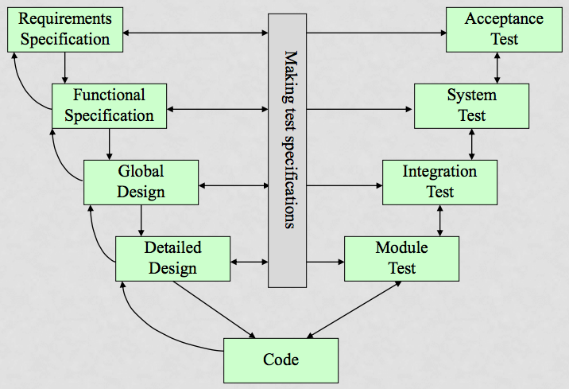
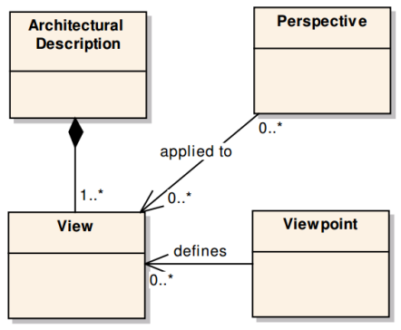

# Notes

## Aanpak
- [OK] Samenvatten slides SE
- [OK] Samenvatten slides SA
- [OK] Leren notities (gastcolleges)
- Doornemen http://rupopmaat.nl/
- Invullen ontbrekende kennis
	- IEEE definitie SA
	- RUP 4+1 viewpoints
	- R&W viewpoints
	- N.a.v. punten oefentoets
	- N.a.v. bekende termen
- Maken oefentoets

## Punten oefentoets

- Typen requirements
- V-model
- White- and black-box-testing
- Happy flow
- RUP 4+1 views
- Contents and stakeholders of those views
- IEEE definitie van Software Architectuur
- Zes viewpoints van Rozanski & Woods
- Attribute Driven Design
- Gebruik scenario template

## Software Engineering

### Waarom RUP?
- Zit tussen Waterval en Agile in
- Behandeld meer procesonderdelen dan Scrum
- Dient op maat gemaakt te worden, dit dwingt tot begrijpen van de aanpak.

### Wat is (R)UP
- Unified Process, een familie van projectbeheer methodieken:
- Kenmerken:
	- Iteratief en incrementeel
	- Use Case gedreven
	- Architectuur centrisch
	- Risico's worden aangevallen
	- Aanpasbaar
	- Focus op kwaliteit d.m.v. documentatie, reviews, tests en voorwerk door specialisten.
- Vier fasen:
	- __Inception__: Inhoud, scope, risico's en globale planning helder krijgen.
		- Vision document, Use Case Model, Glossary, Idee van oplossing en tooling, Software Development Plan (SDP)
	- __Elaboration__: Risico's overwinnen (d.m.v. tests en proof-of-concepts).
		- Uitgewerkte Use Cases (UCs), SAD, SDP bijgesteld, ontwikkelomgeving.
	- __Construction__: Iteraties ontwerpen, bouwen en testen.
		- UCs uitwekren, deelopleveringen voldoen altijd aan functionele eisen en acceptatiecriteria.
	- __Transition__: Bugfixen, trainen, deployment, overdragen aan beheer en afsluiting.
		- Bug fixes, getrainde gebruikers en beheerders, geaccepteerd product, projectevaluatie met feedbackloop.

### Workflows
- Meer dan 100 beschikbare rollen
- Zelf (weloverwogen) besluiten wat je gaat gebruiken
- __Rational Method Composer__: Uitgebreid softwarepakket voor het maken van deze keuzes.

### Use Cases
- Is een set interacties met gemeenschappelijk doel
- Alle use cases samen beschrijven volledige functionaliteit systeem
- Geeft functionele decompositie van het onbekende systeem ('black box')
- Liggen ten grondslag aan RUP
- Definiëren interactie van actor met een systeem
- Bereiken elk een doel
- Dienen als 'contract' voor het gedrag van het systeem
- Worden gezamelijk beschreven
- Zoek juiste niveau 'hoe?' en 'waarom?'

### Voordelen
- Meer aandacht voor architectuur (in tegenstelling tot Scrum)
- Meer aandacht voor documentatie en overdraagbaarheidm, testen en project beheer
- Haalt risico's naar voren

### Nadelen
- Wat documenteer je wel en niet?
- Risico op teveel proces

### Wat zijn requirements
- "Één enkele correcte zin die aangeeft waaraan een systeem moet voldoen"
- Wat is het probleem dat een gebruiker heeft?
- Gedrag, eigenschap of beperking
- Zijn testbaar
- Voorkomen:
	- Mislukken van IT projecten vanwege onduidelijke/veranderende requirements
	- Te weinig betrokkenheid van klanten/gebruikers
	- Gebrek aan ondersteuning door management
	- Geen duidelijke projectorganisatie
- Basis voor schatting kosten, planning, architectuur, ontwerp, testen en acceptatie.
- Moelijk vast te stellen doordat:
	- Een groot ICT systeem zeer complex is
	- Verschillende groepen stakeholders met verschillende belangen
	- Stakeholders hebben onbewuste verwachtingen

### Soorten requirements
- Functioneel: gedrag, waarneembaar voor stakeholders/gebruikers
- Niet-functioneel: (technische) kwaliteitseisen
- Beperking (constraint): bijvoorbeeld tijd of budget
- Een goede requirement is:
	- volledig
	- consistent
	- realistisch
	- testbaar
	- noodzakelijk
	- heler

### Het V-Model

- Validatie: voldoet het systeem aan de verwachtingen van de gebruiker/stakeholder?
- Verificatie: voldoet het systeem aan de requirements/specificaties?

## Software Architecture
- Niveau's van architectuur:
	- Enterprise
	- Applicatie (product)
	- Embedded systeem
	- Infrastructuur (network)
	- Platform
	- CPU
- Enterprise Architectuur is top down, beginnend met de business
- Software Architectuur zijn high-level requirements en het ontwerp van software of een systeem.
- Architectuur:
	- .. is een manier om met stakeholders te communiceren
	- .. zijn de keuzes die (later) niet makkelijk gewijzigd kunnen worden (volgens de ontwikkelaars)
	- .. de fundamentele keuzes, die weloverwogen moeten zijn
	- .. is een high-level ontwerp
	- .. gaat voornamelijk over de niet-functionele eisen
	- .. is de 10% moeite die 90% van de kosten bepaald
- IEEE definitie: __(System) fundamental _concepts_ or _properties_ of a system in its environment embodied in its _elements_, _relationships_, and in the _principles_ of its design and evolution__.
- Verzorgd 'separation of concerns' en consistentie

### Waarom?
- Iedereen heeft de 'big picture' door 'shared understanding'
- Een expliciete vorm van requirements
- Om de stakeholders op één lijn de krijgen
- Hulpmiddel voor het oplossen van conflicten
- Mogelijkheid om complexiteit te beheren (door het verkrijgen van overzicht)
- Inkaderen van het ontwerp door middel van systeem brede keuzes

### Requirements
- Zijn input voor het maken van keuzes
- Requirements <-possibilities<-  ->desires-> Architectuur <-> Ontwerp
- Belangrijk omdat:
	- Foute requirements zijn kostbaar
	- Voorkomen 'feature creep'
	- Afbakening van scope
	- Fundament voor kosten, planning en ontwerp
- User requirements van gebruikers
- System requirements voor ontwikkelaars

### Stakeholders
- Belangrijk
- Moet duidelijk mee worden gecommuniceerd
- Bijvoorbeeld: klanten, gebruikers, opdrachtgevers, het ontwikkelteam, de helpdesk, experts etc.
- Stakeholders moeten representatief zijn

### Software Architectuur Document (SAD)
- Set van producten om architectuur te beschrijven
- Begrijpelijk voor stakeholders
- Moeten aantonen dat de architectuur de bezorgdheden (concerns) van de stakeholders adresseerd
- Bevat producten als: views, models, principles, constraints etc.
- Architectuur definieert structuur, onder meer:
	- Functionele structuur
	- Informatiestructuur
	- Concurrency structuur
	- Ontwerp structuur
	- ...

### Views en Viewpoints
- Een view beschrijft een onderdeel van het systeem
- Een view wordt vertegenwoordigd door één of meerdere modellen
- Views maken het mogelijk om de functionele aspecten en kwaliteitseisen van een systeem te bevatten in een model
- Een viewpoint is een patroon of generalisatie van een view (oftewel een 'template')
- Een viewpoint beidt een model (bijv. diagrammen) waarmee en view kan worden opgesteld

### RUP 4+1
- Best bekende aanpak
- Er bestaan verschillende interpretaties
- Technisch geörienteerd
- Kwaliteitsattributen zijn minder expliciet
- Viewpoints:
	- __Use-Case View__: Key scenarios that drive the discovery, design and validation of the architecture: Use Case Diagram(s) and Use Case Descriptions.
	- __Logical View__: Functionele structuur en gedrag van het systeem, zoals componenten, (sub)systemen en interfaces. __Layers__ op de abstractielaag (domain logic, data access etc.) en __Tiers__ op de service laag (webserver, database server etc.)
	- __Implementation View__: Organisation of software modules: package diagrams, file structure, frameworks, programming languages, OS, database engine, middleware etc.
	- __Deployment View__: Hardeware and network configuration. Ways of communication (protocols).
	- __Process View__: Threads and processes, shared resources and synchronisation. Least used view.

### Rozanski & Woods
- Offspring van RUP 4+1
- Gericht op moderne en op grote schaal gedistribueerde informatie systemen
- Hernoemde viewpoints: Logical, Process en Physical
- Toegevoegde viewpoints: Information en Operational
- Viewpoints:
	- __Functional__: RUP 4+1 Functional Viewpoint
	- __Information__: The way that the architecture stores, manipulates, manages, and distributes information: ERD, data ownership model
	- __Concurrency__: RUP 4+1 Process Viewpoint

	- __Development__: RUP 4+1 Implementation Viewpoint

	- __Deployment__: RUP 4+1 Deployment Viewpoint
	- __Operational__: How the system will be operated, administered, and supported when in produciton. Installation, monitoring, control, etc.

### Kwaliteitskernmerken (quality properties, QP)
- Tot nu toe gehad over __wat__ een systeem moet doen, niet __hoe__ een systeem het moet doen
- De _hoe_ wordt gemeten aan de hand van de kwaliteitskenmerken
- Bijvoorbeeld:
	- Performance
	- Efficiency
	- Security
	- Maintainability
	- Availability
	- ...
- Cruciaal voor stakeholders
- Zijn duidelijke termen en zorgen voor 'shared understanding'

### Perspectives ('vooruitzichten')
| &nbsp; | Viewpoint | Perspective |
| :--- | :--- | :--- |
| Focus | a type of structure | a quality property |
| Result | a view - model(s) a primary arch structure | changes to views supporting artefacts |
| Guidance | models to create advice based on practice | a process for application advice based on practice |

- Een vooruitzicht om views te valideren/toetsen mbt de kwaliteitskenmerken (QPs)
- Een collectie van patterns, templates en richtlijnen om te verzekeren dat een systeem de juiste kwaliteitskenmerken (QPs) heeft
- perspectives worden toegepast op de architectuur om te zorgen dat de kwaliteitskenmerken acceptabel zijn en om de ontwikkeling te begeleiden
	- als het ware unit tests voor views
- Perspective template:
	- __desired quality__: definitie
	- __applicability__ to views: op welke views heeft deze perspective impact
	- __concerns__: die worden geaddresseerd
	- __activities__: how kan de perspective worden toegepast op de architectuur
	- __tactics__: een vastgestelde aanpak voor het toepassen
	- __problems and pitfalls__: waar rekening gehouden mee moet worden
- De initiele set:
	- __Performance and scalability__
		- Concerns: responsetijd, doorvoersnelheden, voorspelbaarheid van het systeem
		- Tactieken: optimaliseren van herhaalde processen, distributie van [processen, het minimaliseren van gedeelde resources.
		- Toepassen: Analyseer de data en maak prestatiemodellen, leg bottlenecks vast.
	- __Security__
		- Concerns: authenticatie, authorisatie, integriteit, beschikbaarheid etc.
		- Tactieken: het inzetten van bewezen beveiligsmethodieken, authorisatie vereisen voor toegang van data etc.
	- __Availability and resilience__
		- Concerns: (on)geplande downtime, MTBF, MTTR, redundantie van data, failover
		- Tactics: Fault tolerant hardware, clusters, load balancing, het loggen van transactions etc.
	- __Evolution__
		- Concerns: De impact van wijzigingen, de kans op wijzigingen, de tijd die het kost om wijzigingen door te voeren, stabiliteit van het systeem etc.
		- Tactics: Het isoleren van wijzigingen, maken van flexibele interfaces, geautomatiseerde testen etc.

### Het toepassen van perspectives op views
- Welke perspectives zijn relevant?
- Voorbeelden:
	- Het identificeren vna gevoelig liggende resources (bijv gebruikerdata in de database)
	- Het identificeren van beveiliginsrisico's (diefstal van backups etc.)
	- Een veiligheidsbeleid opstellen (backups, wat doen we bij chantage of netwerk aanvallen? etc.)

### Tactieken en patterns
- Een architectural pattern implementeerd meerdere tactieken
- Een architectural tactic is een vastgestelde aanpak voor het oplossen van bepaalde kwaliteitskenmerken (QPs)
	- Bijvoorbeeld: dataredudantie vergroot beschikbaarheid bij hardewarefalen
- Drie categorieeën patterns:
	- Creational patterns: object instantiëring en het loskoppelen van afhankelijkheden
	- Structural patterns: het toevoegen van abstractielagen
	- Behavioural patterns: gaat over interactie en gedrag van classen

## Gastcolleges

### Testwerk
- Testen is het vaststellen of iets werkt conform de specificatie
- Geeft inzicht in de kwaliteit
- Voorkomt schade/verlaagt risico
- Kweekt vertrouwen bij de stakeholders
- Niveau: afweging tussen risico dat je kunt en wilt lopen

### Hogeschool Arnhem Nijmegen (HAN)
- Een pattern is: naam, probleem, oplossing
- Gang of Four: vier auteurs
- Extra informatie om pattern beter toepasbaar te maken:
	 - Context
	 - Forces
	 - Resulting context/consequences
	 - Related patterns
	 - Examples
- SA voor het beheersen van de complexiteit
- Lehman's Law:
	1. A program that is used, will be modified
	2. On modification its complexity will increase, unless actively worked against this:
		- Refactored
		- Follow intended architecture

### Rijksdienst Werkverkeer (RDW)
- Eerst een abstract overzicht maken (schets) en aan stakeholders laten zien
- Systemen opgedeeld in domeinen (logische scheiding)
- Waar je niet goed in bent -> uitbesteden
- __Enterprise architectuur is het bij elkaar brnegen van business en IT.__

### Sogeti
- Twee belangrijkste reden voor falen IT projecten:
	1. Instabiele user requirements
	2. Onrealistische begroting
- Project feedback belangrijk:
	- Data vastleggen voor analyse
	- Leren van je fouten
- Functiepuntanalyse (FPA): functionele methode om gebruikers functionaliteit uit te drukken in functiepunten.

### CGI
- Structuur tussen componenten vastleggen
- Wat zijn mijn Externally Visible Properties?

	"Samenhang van componenten van een systeem, hoe die op elkaar reageren en wat je er aan de buitenkant van ziet."

- Functionele decompositie is het opdelen van het systeem in subsystemen
- Parkinsons Law: __"Work expands so as to fill the time available for its completion."__
