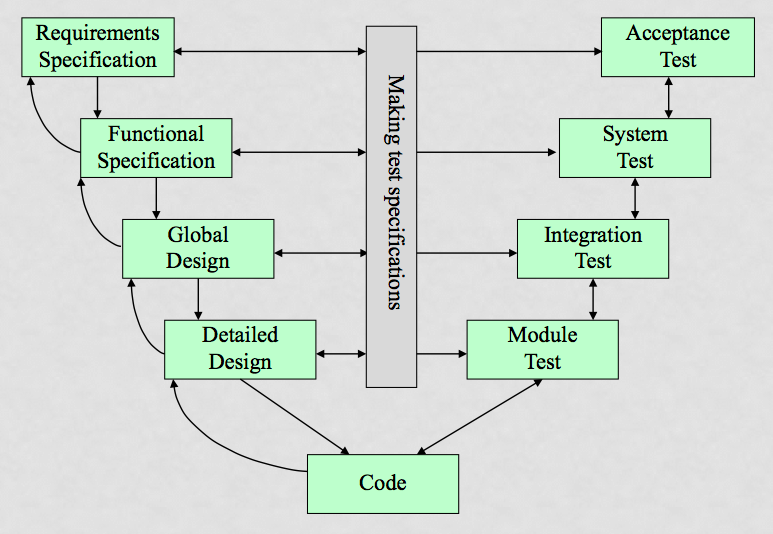

# Wannabe samenvatting
Dit document is een soort van samenvatting. Het bevat gewoon een aantal belangrijke dingen die ik niet terug wil hoeven zoeken in het boek.

## Definities
- **Software Architecture:** (volgens de IEEE 42010) System fundamental *concepts* or *properties* of a system in its environment embodied in its *elements*, *relationships*, and in the *principles* of its design and evolution.

- **Element:** Het fundamentele onderdeel waar een systeem vanuit tot stand is gekomen.

- **Principle:** Een fundamentele verklaring, overtuiging, aanpak of intentie die de definitie van de architectuur begeleidt.

- **View:** A view is a representation of one or more structural aspects of an architecture that illustrates how the architecture addresses one or more concerns held by one or more of its stakeholders.

- **Viewpoint:** A viewpoint is a collection of patterns, templates, and conventions for constructing one type of view. It defines the stakeholders whose concerns are reflected in the viewpoint and the guidelines, principles, and objects in object-oriented development.

## Fasen binnen RUP
Binnen RUP zijn er 4 verschillende fasen te onderscheiden:
- **Inception**
    + Helder krijgen van
        * inhoud
        * scope
        * risico's
        * globale planning

- **Elaboration**
    + Testen van architectuur
    + kritische UC's uitwerken
    + Proof-of-concepts

- **Construction**
    + Interatief ontwerpen, bouwen, testen

- **Transition**
    + Bugfixen
    + Trainen
    + Deployment
    + Overdragen aan beheer
    + Afsluiting

## Viewpoints
### RUP 4+1
Onderstaand zijn de views volgens de 4+1 shizzle terug te vinden:

- **Logical view**
    + Gaat over de functionaliteiten die het systeem biedt aan de eindgebruikers.
    + UML diagrammen die in de logical view voorkomen zijn o.a.:
        * Class diagram;
        * Communication diagram;
        * Sequence diagram.
    + *Stakeholders:*
        * Analisten
        * Designers

- **Implementation/Development view**
    + Beschrijft het systeem vanuit het oogpunt van de programmeur.
    + Gaat over de software management.
    + UML diagrammen die in deze view voorkomen zijn o.a.:
        * Component diagram;
        * Package diagram.
    + *Stakeholders:*
        * Programmeurs

- **Scenarios/Use case View**
    + Beschrijving van het systeem a.d.h.v. use cases.
    + Beschrijft de opeenvolging van interacties tussen objecten en tussen processen.
    + Wordt gebruikt om architecturele elementen te identificeren.
    + Illustreren en valideren van het architecturele design.
    + Fungeert als startpunt voor testen voor een architectureel prototype.
    + *Stakeholders:*
        * Eindgebruikers

- **Process view**
    + Beschrijft de dynamische aspecten van het systeem.
    + Beschrijft de processen van het systeem.
    + Beschrijft hoe de processen met elkaar communiceren.
    + Focust op de runtime behavior.
    + Deze view addresseert:
        * concurrency;
        * distributie;
        * integratie;
        * performance;
        * scalability;
    + UML diagrammen die in deze view voorkomen zijn o.a.:
        * Activiteitendiagram.
    + *Stakeholders:*
        * System integrators

- **Deployment/Physical view**
    + Beschrijft het systeem van het standpunt van de engineer.
    + Gaat over de topologie van de software componenten op de fysieke laag en de fysieke connecties tussen deze componenten.
    + UML diagrammen die in deze view voorkomen zijn o.a.:
        * Deployment diagram.
    + *Stakeholders:*
        * System engineer

###Rozanski & Woods
Onderstaand zijn de viewpoints volgens *Rozanski & Woods* terug te vinden:

- **Context**
    +

- **Functional**
    + Beschrijft de *runtime functionele elementen*, hun verantwoordelijkheden, interfaces en belangrijkste interacties.
    + Bepaald de vorm van andere elementen van het systeem, zoals de informatie structuur, concurrency structuru, deployment structuur, etc.
    + Het heeft een grote impact op de quality properties van het systeem, zoals
        * het vermogen om te veranderen;
        * het vermogen om veilig te zijn;
        * de runtime performance.
    + *Concerns:*
        * Functionele mogelijkheden
        * Externe interfaces
        * Interne structuur
        * Filosofie achter het functionele design
    + *Stakeholders:*
        * Alle stakeholders

- **Information**
    + Beschrijft de manier waarop het systeem omgaat met informatie, zoals het
        * opslaan;
        * aanpassen;
        * beheren;
        * verspreiden.
    + Het geeft een high-level overzicht van de static data structure en de information flow.
    + Het doel van deze view is om een antwoord te geven op de grote vragen rondom
        * content;
        * informatie structuur;
        * ownership;
        * latency;
        * referenties;
        * data migratie.
    + *Stakeholders:*
        * gebruikers;
        * degene die de informatie verzameld;
        * developers;
        * testers;
        * degene die het systeem onderhouden.

- **Concurrency**
    + Bescrhijft de concurrency structuur.
    + Het brengt in kaart welke functionele elementen bij welke concurrency elementen horen, zodat die gedeelten van het systeem die concurrent uitgevoerd kunnen worden, duidelijk in kaart gebracht zijn. Daarnaast wordt duidelijk hoe deze concurrent shizzle wordt gecoördineerd en aangestuurd.
    + *Concerns:*
        * structuur van taken;
        * verbinden van functionele elementen met taken;
        * communicatie tussen processen
        * synchronisatie
        * integriteit
        * ondersteunen van schaalbaarheid
        * opstarten
        * afsluiten
    + *Stakeholders:*
        * degenen die de communicatie verzorgen;
        * developers;
        * testers;
        * enkele beheerders.

- **Development**
    + Beschrijft de architectuur die het ontwikkelproces zal ondersteunen.
    + Het communiceert die gedeelten van de architectuur die van belang zijn voor de stakeholders die betrokken zijn bij
        * het bouwen van het systeem;
        * het testen van het systeem;
        * het onderhouden van het systeem;
        * het verbeteren van het systeem.
    + *Stakeholders:*
        * productie engineers;
        * software ontwikkelaars;
        * testers.

- **Deployment**
    + Beschrijft de omgeving waar het systeem uiteindelijk op zal gaan draaien.
    + Beschrijft de afhankelijkheden die het systeem heeft van de omgeving waar het zal gaan draaien.
    + De omschrijving omvat het volgende:
        * De hardware omgeving die het systeem nodig heeft, met name
            - de processing nodes;
            - de verbindingen binnen het netwerk;
            - de vereiste opslag faciliteiten.
        * De technische vereisten voor ieder afzonderlijk element.
        * Een overzicht van hoe de software elementen gelinkt zijn met de runtime environment die ze uitvoert.
    + *Stakeholders:*
        * systeembeheerders;
        * developers;
        * testers;
        * degene die de communicatie verzorgt;
        * assessor.

- **Operational**
    + Beschrijft hoe het systeem, wanneer het zich in productie bevindt, zal worden
        * bedient;
        * beheert;
        * onderhouden.
    + Het doel van deze view is om systeembrede strategiën te identificeren die gaan over de operationele belangen van de stakeholders van het systeem en om hier oplossingen voor te vinden.
    + *Concerns:*
        * installatie;
        * upgrade;
        * functionele migratie;
        * data migratie;
        * operationele monitoring en toezicht;
        * configuratie management;
        * performance monitoring;
        * support;
        * backup & restore.
    + *Stakeholders:*
        * systeembeheerders;
        * productie engineers;
        * developers;
        * testers;
        * degenen die de communicatie verzorgen;
        * assessoren.

## Happy flow/Happy path
- Een happy path is een default scenario zonder uitzonderingen of error condities. Het bestaat uit het opeenvolgend uitvoeren van een aantal activiteiten wanneer alles gaat zoals gepland.

## Attribute Driven Design
Attribute Driven design is een methodologie om software architectuur te maken, waarbij rekening gehouden wordt met de quality attributes van de software. Voor de rest heb ik geen flauw idee wat ik hier mee moet.

## V-model

- Links staan de specificaties, de requirements en het ontwerp.
- Rechts staan de testen en de acceptatie.
- Het V-model is afgeleid van de watervalmethode.
- Wanneer de producten van een bepaalde fase zijn opgeleverd, worden deze als basis gebruikt voor de volgende fase.
- Er kan niet aan de volgende fase begonnen worden voor de producten van de vorige fase zijn opgeleverd en goedgekeurd.

Welke artifacten?
Wat wordt er getest?
Waar "white-box testing"? (eerst wat is white box testing, zie ook testwerk)
Waar "black-box testing"? (eerst wat is black box testing, zie ook testwerk)

## Ezelsbruggetjes
**Viewpoints van Rozanski & Woods**
***F***riendly ***I***mmense ***C***orps ***D***iddle ***D***ark ***O***ffices
- Functional
- Information
- Concurrency
- Development
- Deployment
- Operational

**Views van RUP 4+1**
***L***oud ***I***ndustries ***U***ndress ***P***laid ***D***onkeys
- Logical view
- Implementation/Development view
- Scenarios/Use case View
- Process view
- Deployment/Physical view

**Fasen binnen RUP**
***I***nnocent ***E***arlobes ***C***url ***T***hirsts

- Inception
- Elaboration
- Construction
- Transition
